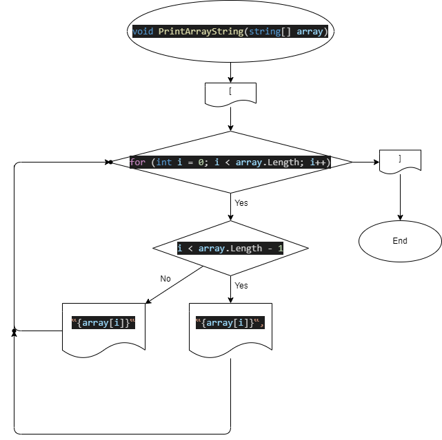

# Задача
```
Написать программу, которая из имеющегося массива строк формирует массив из строк, длина которых меньше либо равна 3 символа. Первоначальный массив можно ввести с клавиатуры, либо задать на старте выполнения алгоритма. 
```
# Содержание
* [Составление алгоритма](#составление-алгоритма)
* [Блок-схема](#блок-схема)
* [Код (синтаксис C#)](#код-синтаксис-c)
* [Описание методов](#описание-методов-кода)
    1. [Метод наполнения массива](#метод-наполнения-массива-с-клавиатуры)
    2. [Метод вывода массива](#метод-вывода-массива-в-терминал)
    3. [Метод фильтрации массива](#метод-фильтрации-массива)


<br>
<hr>


# Составление алгоритма

1. Массив строк (задан или задается вручную)
3. Определение размера нового массива строк
4. Создание нового массива строк
6. Определение строк у которых символов <=3
5. Наполнение нового массива строк

<br>
<hr>

# Блок схема


<br>
<hr>

# Код (Синтаксис C#)

[ПЕРЕЙТИ](Task/Program.cs)

<br>
<hr>

# Описание методов кода

## Метод наполнения массива с клавиатуры

> Создается цикл прохода по массиву, начиная с 0 индекса. Мы задаем значение стоящее под индексом 0, затем увеличиваем наш индекс на 1, и снова задаем значение и так до тех пор, пока индекс меньше размера массива.
```
for (int i = 0; i < array.Length; i++)
    {
        Console.Write($"Введите значения {i} индекса массива: ");
        array[i] = Console.ReadLine();
    }
```

## Метод вывода массива в терминал

> По аналогии с наполнением массива так же создается цикл, отличие лишь в том что вместо ввода значение с клавиатуры мы выводим значение стоящее под текущим индексом.
```
void PrintArrayString(string[] array)
{
    Console.Write("[");
    for (int i = 0; i < array.Length; i++)
    {
        if (i < array.Length - 1) Console.Write($"‟{array[i]}‟,");
        else Console.Write($"‟{array[i]}‟");
    }
    Console.Write("]");
}
```

## Метод фильтрации массива

> Создаем метод:
```
string[] FilterArrayString(string[] array)
{
    Действие метода
}
```
> Можно сделать его более универсальным добавив параметр int n:
```
string[] FilterArrayString(string[] array, int n)
```
> Определяем длину нового массива с помощью переменной count.
```
int count = 0;
for (int i = 0; i < array.Length; i++)
{
    if (array[i].Length <= 3) count++;
}
string[] newArray = new string[count];
```
> Затем заполняем новый массив используя условие:
```
if (array[i].Length <= 3)
```
> Для более универсального метода нужно ввести параметр n и тогда условие будет выглядеть так:
```
if (array[i].Length <= n)
```
> Заполнение нового массива через цикл for:
```
for (int i = 0; i < array.Length; i++)
{
    if (array[i].Length <= 3)
    {
        newArray[k] = array[i];
        k++;
    }
 }
```
> Итог:
```
string[] FilterArrayString(string[] array)
{
    int count = 0;
    for (int i = 0; i < array.Length; i++)
    {
        if (array[i].Length <= 3) count++;
    }
    string[] newArray = new string[count];
    int k = 0;
    for (int i = 0; i < array.Length; i++)
    {
        if (array[i].Length <= 3)
        {
            newArray[k] = array[i];
            k++;
        }
    }
    return newArray;
}
```


